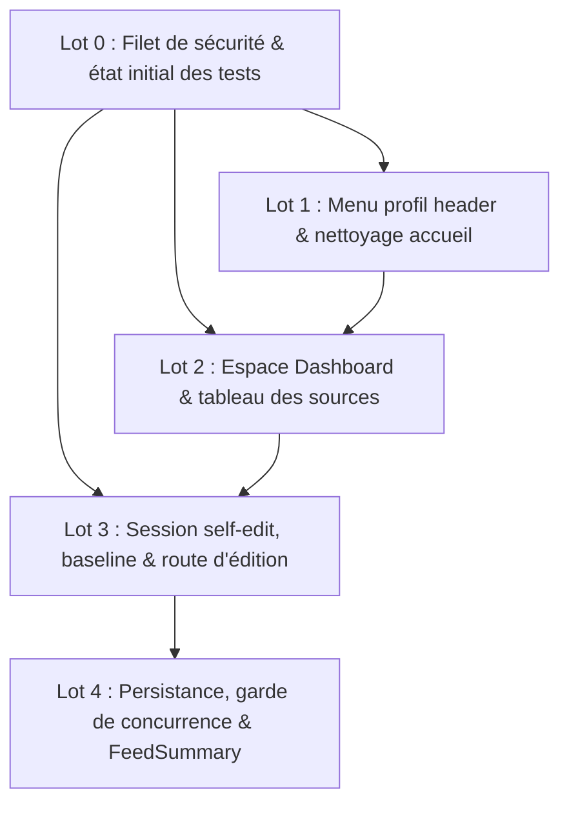

# Feuille de route — Auto-édition d'une MM Source par son auteur (Self-Source-Edit)

**Date :** 2026-08-10  
**Document de cadrage associé :** `20260810_cadrage_self-source-edit.md` — **à lire en premier**.  
Ce document découpe et ordonne les travaux d'implémentation. En cas d'écart, le cadrage fait foi.  
**Document où consigner la progression :** `self-source-edit_progression.md`.

---

## Mode d'emploi

### Pour un agent IA
1. Lire `AGENTS.md` à la racine du dépôt, puis le cadrage, puis **le lot qui vous est assigné**.
2. Ne traiter **qu'un lot à la fois**. Vérifier que ses dépendances sont marquées faites.
3. Respecter les conventions du dépôt : préfixe de source entre crochets dans tout log/erreur (ex: `[selfEdit] ...`), types dérivés de Prisma, `debug` de `utils/debugLogger.ts`, URLs centralisées dans `utils/routes.ts`, Zod dans `types/zodTypes.ts`.
4. **Préférer les éditions ciblées aux réécritures de fichier.**
5. `npx eslint .` pour la validation statique.
6. **Langue des textes de l'application :** TOUS les textes affichés dans l'interface utilisateur (UI, boutons, titres, modales, toasts, placeholders, infobulles, messages d'erreur) doivent impérativement être rédigés en **anglais**.

---

## Graphe de dépendances entre lots

---

## Lot 0 — Préparation et filet de sécurité

**Dépendances :** aucune. **Taille :** XS.

### Tâches
1. Vérifier l'état de la suite de tests avec `npm run test:ci`.
2. Consigner l'état de référence (nombre de suites et de tests passants) dans `self-source-edit_progression.md`.

### Critère de sortie
L'état de départ des tests est consigné dans `self-source-edit_progression.md`.

---

## Lot 1 — Menu profil dans l'en-tête et nettoyage de la page d'accueil

**Dépendances :** Lot 0. **Taille :** S.

### Tâches
1. Mettre à jour `utils/routes.ts` pour déclarer `URL_DASHBOARD = "/dashboard"`.
2. Modifier `ui/NavBar.tsx` :
   - Remplacer le bouton statique `<SignInButton />` par un menu déroulant utilisateur daisyUI (`dropdown dropdown-end`).
   - Lorsque l'utilisateur n'est pas connecté : afficher un bouton invitant à la connexion (`Sign In`).
   - Lorsque l'utilisateur est connecté : afficher un bouton avec icône profil et le nom de l'utilisateur. Au clic/survol, le menu déroulant propose :
     - `Dashboard` → `/dashboard`
     - `Admin` → `/admin` (conditionné à `session.user.role === 'ADMIN'`)
     - `Sign Out` → déclenchant `signOut({ callbackUrl: '/' })`
3. Modifier `app/(public)/page.tsx` :
   - Retirer le composant `<AdminLink />` de la colonne d'actions centrale.
4. Vérifier la compilation TypeScript (`npx tsc --noEmit`) et les tests existants.

### Critère de sortie
La barre de navigation expose le menu profil déroulant, le bouton admin central de la page d'accueil est supprimé, et la route `/dashboard` est référencée.

---

## Lot 2 — Espace Dashboard et liste des sources utilisateur

**Dépendances :** Lot 1. **Taille :** M.

### Tâches
1. Mettre à jour `proxy.ts` :
   - Ajouter `/dashboard/:path*` dans le matcher et dans les règles de contrôle d'accès pour les rôles authentifiés (`USER`, `EDITOR`, `REVIEWER`, `ADMIN`).
2. Créer la page serveur `app/(signedIn)/dashboard/page.tsx` :
   - Vérifier la session utilisateur.
   - Requêter les sources créées par l'utilisateur connecté (`where: { creatorId: session.user.id }`), en incluant les relations nécessaires au calcul des métriques (nombre de pièces, sections, marques métronomiques, statut de revue, date de création).
3. Créer le composant client `features/dashboard/UserMMSourcesTable.tsx` :
   - Afficher le tableau des sources avec les colonnes : Title, Pieces / Composers, Metronome Marks, Review Status Badge (`PENDING`, `IN_REVIEW`, `APPROVED`, `ABORTED`), Created Date, Actions.
   - Action « View Details » : bouton ouvrant une modale daisyUI affichant `MMSourceSummary` (`@/features/explore/MMSourceSummary.tsx`).
   - Action « Edit Source » : bouton actif uniquement si `reviewState === 'PENDING'` et aucune revue active ; sinon désactivé avec tooltip explicatif.
   - Modale de confirmation d'édition au clic sur « Edit Source » informant l'utilisateur que ses modifications seront préparées en brouillon, avec navigation vers `/dashboard/edit/[sourceId]`.

### Critère de sortie
Le dashboard est accessible et affiche les sources de l'utilisateur avec métriques et statuts, la modale de détails s'ouvre, et le clic sur éditer ouvre la confirmation puis redirige.

---

## Lot 3 — Contexte de session, clés de stockage et route d'édition

**Dépendances :** Lot 2. **Taille :** L.

### Tâches
1. Étendre les schémas Zod et types dans `types/zodTypes.ts` :
   - Déclarer `SelfEditSessionMetaSchema = z.object({ mMSourceId: z.string(), authorId: z.string() })`.
   - Intégrer la variante `self-source-edit` dans `FormSessionSchema`.
2. Mettre à jour `context/formSessionContext.tsx` :
   - Supporter `mode === "self-source-edit"` avec synchronisation de `selfEdit` vers la clé de session correspondante.
   - Détecter les incohérences de session (utilisateur connecté différent de l'auteur du brouillon) et purger le brouillon avec notification toast d'avertissement.
3. Mettre à jour `utils/constants.ts` et `utils/localStorage.ts` :
   - Déclarer `SELF_EDIT_LOCAL_STORAGE_PREFIX = "selfEdit"` et `GET_SELF_EDIT_STORAGE_KEYS(mMSourceId)`.
   - Implémenter le helper `purgeSelfEditLocalDrafts(mMSourceId)`.
4. Factoriser le chargement de baseline serveur :
   - Créer `utils/server/getSourceFeedFormBaseline.ts` extrayant la transformation DB → `FeedFormState` depuis `utils/server/getReviewBaseline.ts`.
   - Adapter `utils/server/getReviewBaseline.ts` pour consommer ce helper partagé.
   - Créer le helper `getSourceEditBaseline(mMSourceId)` vérifiant la propriété (`creatorId === session.user.id`), le statut `PENDING` et l'absence de revue active.
5. Créer la route d'édition `app/(signedIn)/dashboard/edit/[sourceId]/` :
   - `layout.tsx` : composant serveur vérifiant les droits et le statut, chargeant la baseline et montant `FormSessionProvider` (`mode: "self-source-edit"`), `FeedFormProvider` (clé `selfEdit:<sourceId>:feedForm`) et `FeedFormShell`.
   - Créer le composant `features/feed/components/SelfEditSessionBanner.tsx` affichant le titre de la source, l'information d'auto-édition et le bouton « Cancel & Return to Dashboard ».
   - `page.tsx` : montant `<MMSourceForm />`.
6. Adapter l'étape `Intro.tsx` (`features/feed/multiStepMMSourceForm/stepForms/Intro.tsx`) pour afficher un texte et bouton adaptés au mode `self-source-edit`.

### Critère de sortie
L'accès à `/dashboard/edit/[sourceId]` charge les données existantes de la source dans le formulaire Feed avec son bandeau dédié et ses clés de stockage isolées.

---

## Lot 4 — Persistance, garde de concurrence et FeedSummary

**Dépendances :** Lot 3. **Taille :** L.

### Tâches
1. Créer la route d'API `app/api/source/[sourceId]/edit/route.ts` (`POST`) :
   - Authentification et contrôle de propriété (`creatorId === session.user.id`).
   - Contrôle atomique de concurrence en transaction : vérifier que `mMSource.reviewState === 'PENDING'` et qu'aucune revue n'a `state === 'IN_REVIEW'`. En cas de conflit, répondre immédiatement avec HTTP 409 Conflict (`{ error: "A review has started on this MM Source. Modifications are blocked." }`).
   - Appliquer `forkModifiedSharedPieceVersions` pour protéger les versions partagées.
   - Mettre à jour la source, références, contributions, pièces, sections et marques métronomiques en maintenant `reviewState = 'PENDING'`.
   - Re-calculer les données dérivées de la source (`computeMMSourceDerivedData`).
2. Adapter `features/feed/multiStepMMSourceForm/stepForms/FeedSummary.tsx` :
   - En mode `self-source-edit` : libellé du bouton « Save Modifications ».
   - Modale de confirmation avant enregistrement.
   - Envoi de la requête à `POST /api/source/[sourceId]/edit`.
   - En cas de 409 Conflict : affichage d'un message d'erreur bloquant explicite informant qu'une revue a démarré.
   - En cas de succès : appel à `purgeSelfEditLocalDrafts(sourceId)` et redirection vers `/dashboard`.
3. Écrire les tests automatisés :
   - `__tests__/api.source.edit.test.ts` (authentification, propriété, rejet 409 sur revue concurrente, succès de la transaction).
   - `__tests__/getSourceFeedFormBaseline.test.ts` (vérification de la conformité de l'état extrait).
   - `__tests__/purgeSelfEditLocalDrafts.test.ts` (purge des 4 clés du local storage).
4. Exécuter `npm run test:ci` et vérifier l'absence totale de régressions.

### Critère de sortie
La soumission d'une auto-édition enregistre fidèlement les modifications en base, bloque tout conflit si une revue a démarré, purge les brouillons locaux et valide l'ensemble de la suite de tests automatisés.
